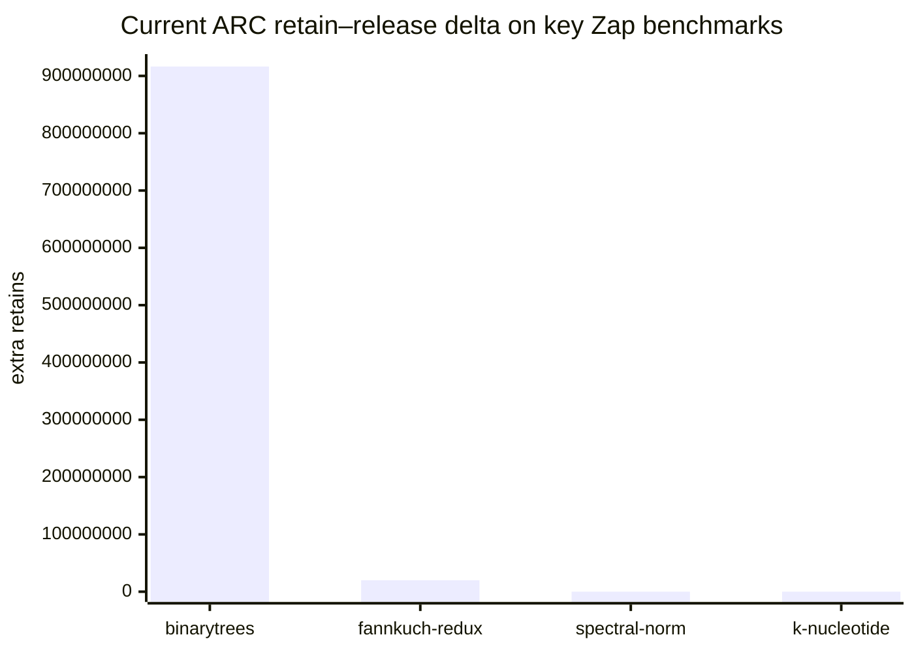
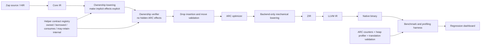
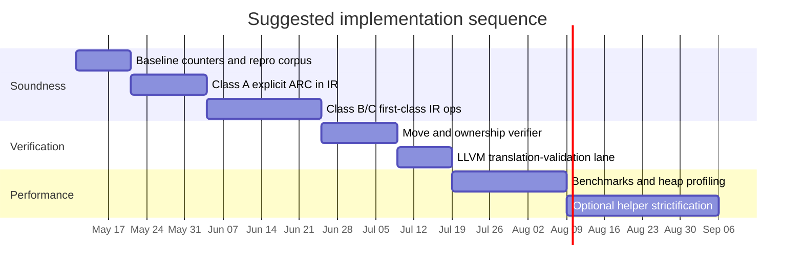

# IR-First ARC Architecture for Zap

## Executive summary

The uploaded brief describes a compiler-architecture problem, not merely a benchmark-tuning problem: Zap’s current ownership model is split between IR-visible ARC instructions and backend-emitted ARC runtime calls, so some retains and releases occur outside the optimizer and verifier surfaces that are supposed to reason about them. The brief ties that split directly to a severe `binarytrees` leak and documents additional mismatches in `fannkuch-redux`, while also showing that non-allocating benchmarks are already healthy. fileciteturn0file0L8-L16 fileciteturn0file0L808-L840 fileciteturn0file0L1399-L1414

Across the strongest industrial and academic precedents, the winning pattern is clear: ownership effects should be preserved in a compiler-visible, optimization-capable intermediate form. The best evidence comes from the urlClang ARC specificationhttps://clang.llvm.org/docs/AutomaticReferenceCounting.html, LLVM’s urlObjCARC optimizer docshttps://llvm.org/doxygen/ObjCARCOpts_8cpp.html, the urlSwift Ownership Manifestohttps://github.com/swiftlang/swift/blob/main/docs/OwnershipManifesto.md, urlPerceushttps://doi.org/10.1145/3453483.3454032, and the recent paper urlOwnership in low-level intermediate representationhttps://arxiv.org/abs/2408.04043. Together, these sources show that explicit ownership effects improve optimization, simplify reasoning, and make verification feasible; when ownership is lost below IR, both optimization and formal reasoning get materially harder. citeturn11view0turn11view1turn12view1turn12view2turn13view0

The best design for Zap is therefore a **hybrid IR-first architecture**. Every **compiler-originated ownership transition on IR-visible values** should become an explicit IR operation. The backend should be forbidden from emitting ARC effects except when mechanically lowering those canonical IR operations. By contrast, **runtime-internal balanced bookkeeping inside collection helpers** does not need to be made 1:1 visible in Zap IR in the first phase, because the brief’s runtime audit already found those sites semantically sound; instead, they should be guarded by explicit helper contracts, targeted verifiers, and regression tests. This gives Zap the principal benefits of strictness where the current bug actually lives, without forcing an immediate rewrite of the entire runtime extraction API surface. fileciteturn0file0L1025-L1047 fileciteturn0file0L1213-L1223 citeturn11view0turn11view1turn12view2turn11view9

The short implementation priority is straightforward. First, eliminate the backend-side Class A, B, and C violations the brief enumerates. Second, strengthen ownership verification around `move_value`, `arc_managed_locals`, and reuse/reset semantics. Third, use `binarytrees` and `fannkuch-redux` as hard soundness gates, while treating `spectral-norm` and `k-nucleotide` as phase-two uniqueness/allocator targets rather than primary ARC-balance failures. The recommended architecture below is designed to reach that outcome with contained compiler churn, explicit line-level change anchors, and a validation loop that combines regression tests, profiling, and translation validation. fileciteturn0file0L982-L1024 fileciteturn0file0L1131-L1145 fileciteturn0file0L1422-L1435 citeturn11view9

## Assumptions and problem framing

Because the user left domain, budget, timeline, target users, and deployment environment open-ended, this report treats those items as assumptions and makes them explicit. The working scope is **Zap compiler memory-management architecture** on the currently described pipeline and hardware context, with the success criterion defined as: restore ownership soundness first, then recover runtime memory behavior on allocation-heavy CLBG-style programs, then improve optimizer quality. The brief also imposes hard constraints: production-grade fixes only, no hacks, test-driven implementation, and no dependence on raising macOS’s 8 MB thread-stack ceiling. fileciteturn0file0L223-L228 fileciteturn0file0L1593-L1638

| Assumption | Working decision | Why this is reasonable |
|---|---|---|
| Problem domain | Zap compiler ARC emission and ownership semantics | The brief is explicit that the task is “making the IR the single source of truth” for ARC effects. fileciteturn0file0L8-L16 |
| Primary users | Compiler/runtime maintainers, not application developers | The relevant artifacts are `zir_builder.zig`, ARC passes, runtime helpers, and benchmark harnesses. fileciteturn0file0L1498-L1548 |
| Deployment environment | Existing Zap → ZIR → LLVM/native pipeline on macOS/aarch64 first, then generalize | The brief gives exact toolchain and platform context and notes the design should still generalize. fileciteturn0file0L221-L228 |
| Budget and staffing | Open-ended budget; estimates below are relative effort bands for a small compiler team | The user explicitly left budget open-ended. |
| Success metrics | ARC correctness first; then RSS/runtime improvements; then compile-time/ergonomics | The brief’s benchmark analysis clearly separates soundness failures from uniqueness/allocator issues. fileciteturn0file0L1413-L1435 |

The chart above uses the counter snapshots in the uploaded brief. Its main point is architectural: `binarytrees` and `fannkuch-redux` are currently hard ownership-accounting failures, while `spectral-norm` and `k-nucleotide` are mostly post-soundness optimization problems involving uniqueness proof quality and allocator behavior. That distinction should drive the implementation order. fileciteturn0file0L828-L840 fileciteturn0file0L1422-L1435

## State of the art

The literature over the last decade does not point to a single universally superior memory-management model. Instead, it points to a family of successful designs that all make **ownership information explicit somewhere important**: in a mid-level IR, in a borrow/type system, in low-level verification annotations, or in a carefully constrained runtime contract. What differs is where ownership becomes explicit and how much of it is statically known versus dynamically maintained. citeturn11view0turn12view1turn12view2turn13view0turn15view8

### Literature survey

| Source | Type | Main contribution | Why it matters for Zap |
|---|---|---|---|
| Clang ARC specification | Official industrial design doc | Defines ARC as a complete compiler/runtime technical specification, not an ad hoc lowering detail. citeturn11view0 | Strong evidence that ownership semantics should be specified at compiler boundaries, not buried in backend helpers. |
| LLVM ObjCARC optimizer | Official industrial optimizer doc | ARC ops are explicit enough in LLVM to support redundant, partially redundant, and inconsequential ARC-op elimination. citeturn11view1 | Explicit ownership effects unlock pass-level optimization and verification. |
| Swift ownership work | Official industrial design doc plus evolution roadmap | Swift distinguishes values “in flight” from values “at rest” in memory, and newer evolution work explicitly ties noncopyable/nonescapable features to “ARC improvements and ownership control.” citeturn12view1turn7search0turn7search2turn7search4 | Zap should separate transfer, borrow, and durable ownership establishment rather than overloading generic dataflow ops. |
| Dynamic Atomicity | Peer-reviewed industrial paper | Shows Swift ARC overhead can be dominated by atomic RC updates; Biased RC improves average client execution time by 22.5% and server throughput by 7.3%. citeturn20view0 | Important later-stage optimization if Zap stays atomic, but only after ownership semantics are correct. |
| Counting Immutable Beans | Peer-reviewed paper / arXiv | Shows exact reference counts enable destructive updates, borrowed references reduce RC traffic, and a compiler/runtime for a pure language can be competitive with state-of-the-art compilers. citeturn23view0 | Supports explicit borrow/ownership distinctions and uniqueness-aware optimization in Zap. |
| Lean 4 paper | Peer-reviewed paper | Lean’s RC-based runtime exploits the “resurrection hypothesis”; pure code can perform destructive updates and often outperforms OCaml/GHC on memory-intensive cases. citeturn12view4 | Validates RC plus uniqueness in a real language/compiler stack, not just a toy model. |
| Perceus | Peer-reviewed PLDI paper | Emits precise RC instructions in a functional core language such that cycle-free programs are garbage-free; implemented in Koka and reported as competitive with mature collectors. citeturn12view2turn17view0turn17view2 | Direct precedent for “make ownership effects explicit in IR, then derive reuse and optimization from that.” |
| Frame Limited Reuse | Peer-reviewed ICFP paper | Shows a drop-guided reuse transformation that is frame-limited rather than arbitrarily space-inflating; on `binarytrees`, Koka outperforms all compared languages except C++. citeturn17view3turn17view4turn12view3 | Strong support for a first-class `reuse_alloc` operation, but also a warning that reuse semantics must be reasoned about explicitly. |
| Nim ARC/ORC docs | Official industrial/open-source docs | ORC is a reference-counting default with trial-deletion cycle collection; the runtime is based on destructors and move semantics rather than classical tracing GC. citeturn11view6turn11view7 | Good evidence for a pragmatic RC+cycle strategy if Zap later needs cyclic data support. |
| Rust ownership + RustBelt | Official docs plus peer-reviewed proof | Rust uses ownership/borrowing to get memory safety without a GC, and RustBelt formally proves safety for a realistic subset with unsafe-library extensions. citeturn15view8turn15view9turn26search6 | The cleanest precedent for `move_value` invalidation semantics and borrow-aware verification. |
| Ownership in low-level IR | Recent research paper | Shows ownership information is lost in LLVM-like IR, adds ownership/borrow/copy ops directly to low-level IR, and reports 1.3×–5× SMT-solving speedups. citeturn13view0 | Direct evidence that preserving ownership into lower IRs materially improves reasoning and verification. |
| Alive2 | Peer-reviewed verification paper | Automatic bounded translation validation for LLVM, capable of finding bugs “from straightforward bugs all the way to fundamental flaws in the IR’s design.” citeturn11view9 | Excellent fit for verifying ARC-affecting transformations once Zap lowers to LLVM. |
| Spegion and Dynamic Region Ownership | Recent research papers | Show continuing work on region-based and ownership-based alternatives, including dynamic-region ownership for concurrency safety in Python-like settings. citeturn24view0turn24view1 | Important contrast class: powerful, but too disruptive for Zap’s near-term ARC refactor. |

The synthesis is more important than any single paper. Industrial systems such as Clang/LLVM and Swift demonstrate that ARC becomes manageable when ownership is made visible to compiler passes. Lean and Koka show that RC can be fast enough even in functional settings when combined with borrowing, uniqueness, and reuse. Rust and the recent low-level ownership-IR work show that **move, borrow, copy, and deinitialization semantics** are not optional niceties; they are the vocabulary needed to verify memory correctness mechanically. Nim shows the practical path if cycles later become unavoidable. citeturn11view0turn11view1turn12view4turn12view2turn11view6turn13view0turn15view9

## Comparison of approaches

The table below compares the top realistically relevant approaches for Zap’s problem. It mixes architecture patterns and memory-management strategies because the practical design choice is not “pick one paper,” but “decide which combination of ideas Zap should institutionalize.” The “evaluation corpus” column is included exactly because the user asked for datasets; where the official source is a spec rather than an empirical paper, that is stated directly. citeturn11view0turn17view0turn20view0turn13view0

| Approach | Strengths | Weaknesses | Evaluation corpus / datasets used | Reported metric | Compute / resource needs | Maturity |
|---|---|---|---|---|---|---|
| **Pure centralized-effect implicit ARC** | Lowest immediate compiler churn; no runtime API rewrite | Keeps hidden semantics; new passes can still forget ownership effects; already failed in Zap | Zap’s own benchmark corpus in the brief | `binarytrees` shows +916,455,450 leaked retains; `fannkuch-redux` about +19.96M; allocator-heavy benchmarks explode in RSS. fileciteturn0file0L828-L840 fileciteturn0file0L1422-L1435 | Low compiler work, but runtime memory cost can become catastrophic | **Prototype / fragile** |
| **Hybrid IR-first explicit ownership plus audited helper contracts** | Fixes the actual leak mechanism; keeps optimizer/verifier visibility where it matters; avoids rewriting sound runtime helpers immediately | Not a literal 1:1 IR model for helper-internal balanced RC | Backed by Clang/LLVM ARC, Swift ownership, runtime audit in brief | No single public metric because this is a synthesis, but it aligns with production ARC compiler patterns and the brief’s runtime audit found zero helper-side soundness gaps. citeturn11view0turn11view1turn12view1 fileciteturn0file0L1025-L1047 | Medium compiler work; low runtime disruption | **Best near-term production fit** |
| **Full strict explicit ARC through runtime extraction boundaries** | Strongest invariant; easiest long-term reasoning; maximal future-proofing | Requires broad runtime contract rewrite; larger blast radius | Cost estimate and scope are explicit in the brief | The brief estimates roughly ~2000 lines of runtime and ~1000 lines of compiler change for strict extraction-path refactoring. fileciteturn0file0L1213-L1219 | High compiler + runtime churn | **Prototype path, not first milestone** |
| **Perceus-style precise RC with reuse** | Very strong formal story; explicit RC ops; excellent reuse potential on acyclic workloads | Cycle-free assumption matters; more analysis complexity; Koka itself remains research-oriented | Koka benchmark suite, mostly memory-allocation-heavy benchmarks based on Lean suite; also `binarytrees`, `nqueens`, `cfold`, `deriv`. citeturn17view0turn17view3 | Competitive with mature collectors; on `binarytrees`, only C++ beats Koka in the cited comparison. citeturn12view2turn17view3 | Higher compile-time analysis complexity; low runtime overhead when analysis succeeds | **Research / advanced prototype** |
| **ARC/ORC hybrid with cycle collection** | Deterministic-ish RC base with an answer for cycles; practical for language deployment | Trial deletion complicates performance predictability; less attractive for hard realtime | Nim’s ARC/ORC runtime docs | ORC is the default in cited Nim docs; cycles are handled by trial deletion. citeturn11view6turn11view7 | Medium runtime and implementation complexity | **Production** |
| **Borrow checker / move semantics first** | Best long-run memory-safety story; no ARC overhead on many paths; strong formal precedent | Highly disruptive to an existing language and compiler architecture | Rust language docs and RustBelt proof corpus | Formal proof for a realistic Rust subset; move invalidates prior owner until reinit. citeturn15view9turn26search6 | High compiler/type-system cost, low runtime cost | **Production, but too disruptive for this refactor** |
| **Region-based ownership** | Excellent peak-memory potential in the right domain; concurrency-safety avenues | Programmer-model and compiler complexity are both high; immature for Zap’s current needs | Spegion and Python-region prototypes | Recent work is promising, but still research-first and not drop-in for a Zap-like architecture. citeturn24view0turn24view1 | High compiler/runtime redesign cost | **Research** |

The recommendation is the **second row**: **hybrid IR-first explicit ownership plus audited helper contracts**. That design preserves the central lesson from Clang/LLVM, Swift, Perceus, Lean, and ownership-IR verification—ownership must be visible where the compiler reasons about it—while respecting the brief’s finding that runtime-internal helper ARC is not the current source of unsoundness. Pure centralized-effect is demonstrably too weak for Zap’s present failure mode, and full strictness can be reserved as an optional later phase if the audited helper boundary becomes the next bottleneck. fileciteturn0file0L727-L785 fileciteturn0file0L1025-L1047 citeturn11view0turn11view1turn12view2turn13view0

## Recommended architecture

The recommended architecture has one governing rule:

**Every ownership effect introduced by the compiler on an IR-visible value must be represented by a first-class IR operation before lowering reaches ZIR.** Runtime helpers may still perform internally balanced retains/releases, but those helpers must be treated as contract-bearing effectful primitives, not as places where backend lowering quietly invents caller-visible ownership changes. This is the narrowest rule that fixes Zap’s current bug pattern while remaining technically and economically sensible. fileciteturn0file0L727-L785 fileciteturn0file0L982-L1024 citeturn11view0turn11view1turn13view0

This flow mirrors the best patterns in the sources. ARC must become explicit **before** optimization and verification; after that point, ZIR lowering should only translate canonical ownership ops, just as Clang/LLVM treat ARC as a compiler-visible semantic layer and as Perceus emits explicit reference-counting instructions prior to reuse analysis. Verification then becomes practical: the ownership checker can enforce local invariants, and LLVM-level translation validation can check that affected transforms still refine the original semantics. citeturn11view0turn11view1turn12view2turn11view9

### Key design decisions

| Area | Recommendation | Rationale |
|---|---|---|
| Strict vs centralized effect | **Hybrid**: strict for compiler/backend ownership effects; contract-based for runtime-internal balanced helper effects | Fixes the actual leak source without rewriting sound helper internals immediately. fileciteturn0file0L1025-L1047 fileciteturn0file0L1213-L1223 |
| `.retain` shape | Use a single `.retain` opcode with a small enum payload such as `normal`, `persistent`, `optional` | Zap already distinguishes these concepts in backend helper calls; keeping them explicit in IR makes the semantics self-describing without opcode explosion. This is also closer to Swift/ownership-IR style “same family, distinct ownership states.” fileciteturn0file0L990-L992 citeturn12view1turn13view0 |
| `.move_value` semantics | Make it **pure ownership transfer plus source invalidation**; no runtime ARC call on lowering | Rust’s move semantics and the Rust reference both support deinitialization of the source after move; this is the cleanest basis for Zap verifier rules. fileciteturn0file0L588-L590 citeturn26search6turn26search0 |
| Class B reset behavior | Promote reset paths to first-class IR (`.reset_alloc` or semantically equivalent) | Analysis-driven side emission is exactly the sort of hidden effect that current architecture cannot safely sustain. fileciteturn0file0L1009-L1024 |
| Class C reuse behavior | Add a standalone `.reuse_alloc` instruction rather than hiding reuse inside constructor metadata | Explicit effect nodes are easier to verify, optimize, and benchmark; Perceus and frame-limited reuse both argue for making reuse semantics explicit. fileciteturn0file0L1019-L1024 citeturn12view2turn17view4 |
| Aggregate construction | Emit explicit retains only when aggregate construction establishes durable ownership and the source is not being moved/consumed | Aggregate construction is an ownership-establishing boundary; hiding it in lowerings recreates the same verification problem. fileciteturn0file0L597-L600 |
| `list_get` / `map_get` / extraction helpers | Keep today’s helper-internal retains in phase one, but annotate helper contracts as `returns_owned` versus `returns_borrowed`; later strictification is optional | The brief’s runtime audit found these helpers semantically sound; the urgent bug is elsewhere. fileciteturn0file0L601-L604 fileciteturn0file0L1027-L1047 |
| `list_set` / COW paths | Make destination ownership and rebind-release behavior visible to `arc_managed_locals` and drop insertion; do not assume current seed logic is complete | The brief directly identifies `fannkuch-redux` as likely involving `arc_managed_locals` seeding or missing rebind release. fileciteturn0file0L1422-L1426 |
| Verifier strategy | Add a pre-backend “no hidden ARC emissions” verifier and a post-LLVM translation-validation lane for affected passes | This combines local ownership invariants with LLVM refinement checking. citeturn11view9 |
| Threading and atomics | Keep the current atomic RC model through the soundness refactor; evaluate biased or ownership-guided non-atomic fast paths only after benchmark evidence | Swift/BRC shows atomic RC overhead is real, but that is a second-order problem relative to today’s unsoundness. citeturn20view0 |

### Concrete file anchors and first change set

The uploaded brief already identifies the right edit points. For implementation planning, the following anchors should be treated as the first wave of changes. These are **brief-provided line anchors**, so exact numbers may drift slightly in the live repo, but they are the correct starting surface. fileciteturn0file0L1498-L1548

| First change set | Files and anchor lines from the brief |
|---|---|
| Canonical ARC lowerings | `src/zir_builder.zig:3900–3927` |
| Delete / replace Class A backend-side retains | `src/zir_builder.zig:4178–4207`, `4292–4310`, `5673–5727` |
| Replace analysis-driven side emissions with explicit IR | `src/zir_builder.zig:3950, 3965`, `3982, 3984` |
| Introduce `.reuse_alloc` lowering | `src/zir_builder.zig:5573`, `5921` |
| Audit ownership/liveness seed logic | `src/arc_liveness.zig:210`, `499`; `src/zir_builder.zig:537, 544` |
| Re-check ownership classification | `src/arc_ownership.zig:1–150` |
| Re-run drop insertion assumptions | `src/arc_drop_insertion.zig:1–125`, `~150` |
| Reconfirm call/borrow parameter conventions | `src/arc_param_convention.zig:1–110` |
| Keep debug/inspection hooks available | `src/compiler.zig:2313`, `2335` |

### Tech stack options and trade-offs

For the near-term refactor, the best stack is conservative: keep the existing ZIR/LLVM path; add a dedicated ownership verifier in Zap IR; use LLVM-level translation validation with urlAlive2https://github.com/AliveToolkit/alive2 for affected optimization paths; profile allocation churn with urlHeaptrackhttps://apps.kde.org/heaptrack/; and benchmark allocator sensitivity with both the system allocator and urlmimallochttps://github.com/microsoft/mimalloc, whose design explicitly targets reference-counting language runtimes. A whole-pipeline move to MLIR or a region-first runtime would be a category error here: both would spend large amounts of engineering capital before eliminating the concrete ownership mismatch the brief already localized. citeturn15view0turn15view1turn15view2turn11view9

## Risks, safety, privacy, and regulation

The main risks are technical, but they are not merely performance risks. Hidden ownership effects create the classic memory-safety triad: leak, use-after-free, and double-free risk. The brief currently shows the leak side of that spectrum, but the same architectural split would make any future optimization or helper evolution harder to reason about. Recent low-level ownership-IR research is especially relevant here because it shows that once ownership disappears below IR, reasoning quality degrades enough to measurably slow formal analysis. fileciteturn0file0L8-L16 fileciteturn0file0L982-L1024 citeturn13view0

The second risk is space behavior under reuse and recursion. The `reuse_alloc` direction is good, but it should not be introduced as opaque constructor sugar. The frame-limited reuse literature shows exactly why: reuse systems that are not explicitly reasoned about can increase peak space arbitrarily, whereas frame-limited reuse gives a much more tractable bound tied to call-stack depth. That matters for Zap because the brief explicitly forbids solutions that only work by raising the macOS 8 MB thread-stack ceiling. citeturn17view4 fileciteturn0file0L223-L228

The third risk is concurrency overhead. If Zap’s future workloads become more shared and multi-threaded, atomic RC cost can become dominant, as the Swift/BRC work shows. However, it would be a mistake to solve this first. A biased or ownership-guided non-atomic fast path only makes sense once the compiler can state, and verify, when a reference is uniquely or thread-locally owned. In practice, correctness first and contention reduction second is the right order. citeturn20view0

Privacy and security considerations are secondary but real. A leak that keeps objects live longer than intended enlarges the window in which sensitive data can remain resident in memory, appear in crash dumps, or be captured in heap profiles. That is an engineering inference from the observed leak behavior, but it aligns with mainstream secure-development guidance: NIST’s SSDF emphasizes producing well-secured software, protecting software artifacts, and responding to residual vulnerabilities, while the EU Cyber Resilience Act extends lifecycle security duties to software products more broadly. fileciteturn0file0L808-L840 citeturn27view1turn27view0

There is no regulation specific to “ARC refactors,” but if Zap is used in regulated toolchains, the evidence artifacts from this program should be reusable for compliance. For general software producers, the most relevant framework is NIST SSDF. For software shipped into the EU as a product with digital elements, the Cyber Resilience Act introduces lifecycle obligations around design, development, maintenance, and vulnerability handling. For safety-critical downstream users, the relevant process frameworks include ISO 26262 for automotive E/E systems and DO-178C for airborne software assurance. The implication is practical: the refactor should produce traceable invariants, regression evidence, and documented tool behavior, because those are the artifacts that regulated environments actually consume. citeturn27view1turn27view0turn27view2turn27view3

| Risk | Likelihood | Impact | Mitigation |
|---|---|---|---|
| Hidden backend-side ARC emission reappears | High unless structurally prevented | High | Add a hard verifier that canonical ARC calls may only be emitted from the `.retain` / `.release` / `.reset_alloc` / `.reuse_alloc` lowering paths. fileciteturn0file0L1513-L1521 |
| `move_value` causes latent use-after-move bugs | Medium | High | Treat moves as deinitialization of the source local; reject reads until reinit; add dedicated IR tests. citeturn26search6 |
| `reuse_alloc` increases peak memory in recursive code | Medium | Medium/High | Keep reuse explicit and benchmark for frame-limited behavior. citeturn17view4 |
| `arc_managed_locals` misses ownership-establishing destinations | High | High | Expand seed-walk tests and benchmark-derived repros (`fannkuch-redux`, list rebind cases). fileciteturn0file0L1422-L1426 |
| Cyclic data structures become common later | Medium | Medium | Keep ORC/trial-deletion or another cycle-collection option on the roadmap, but do not entangle it with phase-one ARC soundness. citeturn11view6turn12view3 |
| Atomic RC dominates future multi-thread workloads | Medium | Medium | Only after soundness, evaluate BRC-style optimization with representative shared workloads. citeturn20view0 |

## Roadmap, validation, and primary resources

The roadmap below assumes one experienced compiler engineer as the effort baseline, with review support from a second maintainer. “Low,” “Medium,” and “High” cost are therefore **relative engineering bands**, not dollar amounts. Because the user left timeline open-ended, the schedule is phased by dependency rather than by a fixed release date. The hidden rule is simple: do not spend time on allocator or atomic-RC optimizations until the Class A/B/C ownership mismatches are gone. fileciteturn0file0L1099-L1145 fileciteturn0file0L1422-L1435

| Phase | Scope | Milestone | Effort | Cost range |
|---|---|---|---|---|
| Baseline and invariants | Freeze current counters, RSS baselines, and IR dumps for key benchmarks; add “no hidden ARC calls” failing tests | Repro suite green/red on demand | 1–2 engineer-weeks | Low |
| Class A remediation | Remove backend-side retains from `.copy_value`, `.share_value`, and indirect-recursive `.field_get`; emit explicit IR equivalents | `binarytrees` ARC delta collapses toward zero; no regression in `nbody`/`mandelbrot` | 1–2 engineer-weeks | Low |
| Class B and C promotion | Promote drop specializations, reset behavior, and reuse behavior to first-class IR ops | No backend-side analysis emissions remain; reuse/reset visible in IR dumps | 2–4 engineer-weeks | Medium |
| Ownership verifier hardening | Enforce move invalidation, destination seeding, helper contract checks, and canonical lowering rules | Verifier blocks new hidden ownership effects before backend lowering | 2–3 engineer-weeks | Medium |
| Benchmark and optimizer pass | Re-run CLBG-style corpus, heap profiling, allocator A/B, and translation validation on affected passes | `fannkuch-redux` fixed; `spectral-norm`/`k-nucleotide` classified as uniqueness or allocator work, not ARC imbalance | 2–4 engineer-weeks | Medium |
| Optional strictification phase | Refactor extraction helpers to return borrowed references if the team wants full helper-boundary strictness | Runtime helper ownership becomes explicit at call sites | 4–8 engineer-weeks | High |

### Validation and evaluation plan

The evaluation plan should be **tiered**. First prove ownership accounting. Then prove functional correctness. Then prove memory recovery. Then optimize. This ordering is not just good engineering discipline; it matches the problem decomposition already present in the brief. fileciteturn0file0L1554-L1588 fileciteturn0file0L1413-L1435

| Dimension | Metrics | Pass gate | Benchmarks / tools |
|---|---|---|---|
| Ownership soundness | `retains_total - releases_total`, live-pool high-water vs exit live count, verifier pass rate | No large positive ARC delta on `binarytrees` and `fannkuch-redux`; no uncategorized hidden ARC ops | `binarytrees`, `fannkuch-redux`, IR dump hooks, ARC counters. fileciteturn0file0L828-L840 |
| Functional correctness | Output equivalence, existing unit/integration tests, recursive-struct tests | Zero functional regressions; all existing recursive-field tests green | `test/struct_test.zap`, `test/recursion_test.zap`. fileciteturn0file0L1540-L1548 |
| Memory behavior | Peak RSS, allocation hot spots, exit live counts | `binarytrees` and `fannkuch-redux` reduce RSS by at least an order of magnitude from current baselines; `spectral-norm`/`k-nucleotide` show no ARC imbalance even if uniqueness remains weak | urlHeaptrackhttps://apps.kde.org/heaptrack/, allocator A/B with urlmimallochttps://github.com/microsoft/mimalloc. citeturn15view1turn15view0turn15view2 |
| Runtime performance | Wall-clock time, instruction count proxies, IR size, compile-time overhead | No >10% compile-time regression on benchmark suite; steady or improved runtime on non-allocating benchmarks | `nbody`, `mandelbrot`, CLBG hot-loop cases. fileciteturn0file0L1404-L1414 |
| Optimization correctness | Refinement checks across affected LLVM transforms | No failed refinement checks in ARC-touching passes | urlAlive2https://github.com/AliveToolkit/alive2. citeturn11view9 |

### Recommended datasets, tools, and primary sources

There is no single standard public dataset for “IR/source-of-truth ARC alignment.” The literature instead evaluates with **language benchmarks**, **compiler/runtime microbenchmarks**, and **verification corpora**. The most practical resource bundle for Zap is therefore a blended one: the brief’s internal repros, allocation-heavy CLBG programs, formal verifiers, and reference implementations that already embody ownership-aware design. That recommendation is an inference from how the cited papers actually evaluate their claims. citeturn17view0turn17view3turn13view0turn15view3

**Primary papers and official design documents**

- urlClang ARC specificationhttps://clang.llvm.org/docs/AutomaticReferenceCounting.html
- urlLLVM ObjCARC optimizer docshttps://llvm.org/doxygen/ObjCARCOpts_8cpp.html
- urlSwift Ownership Manifestohttps://github.com/swiftlang/swift/blob/main/docs/OwnershipManifesto.md
- urlDynamic Atomicity paperhttps://doi.org/10.1145/3133841.3133843
- urlCounting Immutable Beans paperhttps://arxiv.org/abs/1908.05647
- urlLean 4 paperhttps://lean-lang.org/papers/lean4.pdf
- urlPerceus paperhttps://doi.org/10.1145/3453483.3454032
- urlFrame Limited Reuse paperhttps://doi.org/10.1145/3547634
- urlOwnership in low-level IR paperhttps://arxiv.org/abs/2408.04043
- urlRust ownership chapterhttps://doc.rust-lang.org/book/ch04-00-understanding-ownership.html
- urlRust reference on moved valueshttps://doc.rust-lang.org/reference/expressions.html#moved-and-copied-types
- urlRustBelt paperhttps://plv.mpi-sws.org/rustbelt/popl18/paper.pdf
- urlNim ARC/ORC memory docshttps://nim-lang.org/docs/mm.html
- urlNim destructors and move semantics docshttps://nim-lang.org/docs/destructors.html

**Open-source reference implementations**

- urlswiftlang/swifthttps://github.com/swiftlang/swift
- urlleanprover/lean4https://github.com/leanprover/lean4
- urlkoka-lang/kokahttps://github.com/koka-lang/koka
- urlnim-lang/nimhttps://github.com/nim-lang/nim

**Benchmarks and datasets**

- urlThe Computer Language Benchmarks Gamehttps://benchmarksgame-team.pages.debian.net/benchmarksgame/index.html
- urlGC Bench by Hans Boehmhttps://hboehm.info/gc/gc_bench
- The uploaded Zap brief’s own reproduced workloads and counters, especially `binarytrees`, `fannkuch-redux`, `spectral-norm`, and `k-nucleotide`. fileciteturn0file0L1399-L1435

**Verification, profiling, and benchmarking tools**

- urlAlive2https://github.com/AliveToolkit/alive2
- urlHeaptrackhttps://apps.kde.org/heaptrack/
- urlmimallochttps://github.com/microsoft/mimalloc
- urlhyperfinehttps://github.com/sharkdp/hyperfine

The bottom line is that Zap does **not** need an exotic new memory model to solve the current problem. It needs an ownership architecture that is explicit enough to verify, optimize, and benchmark. The state of the art strongly supports that direction, and the uploaded brief already identifies the exact places where the refactor should begin. fileciteturn0file0L1099-L1145 fileciteturn0file0L1498-L1548 citeturn11view0turn11view1turn12view2turn13view0turn11view9
