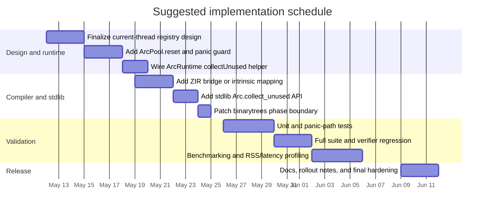

# Deep Research Report on the Zap ArcPool Page-Return Problem

## Executive summary

This report is scoped to the uploaded research brief, which defines a specific systems problem rather than a generic one: Zap’s ARC runtime uses a per-type, thread-local `ArcPool(T)` built on Zig’s `std.heap.MemoryPool`, and the current implementation never calls `reset(.free_all)`. In the `binarytrees` benchmark, that means the stretch-tree phase raises the pool’s high-water mark to roughly four million `Arc(Tree).Inner` cells, and those pages stay mapped even after the cells are returned to the free list. The brief reports 193 MB peak RSS for Zap versus 129 MB for the C reference at `N=21`, after earlier ARC leaks and ownership issues were already fixed. fileciteturn0file0 fileciteturn0file0L58-L124 fileciteturn0file0L165-L206 citeturn9view0turn9view1

The strongest recommendation is to implement a **production-grade, explicit, current-thread compaction primitive**: add `reset()` to `ArcPool(T)`, guard it with `live == 0`, register instantiated pools in a **thread-local** registry, expose a Zap-level `Arc.collect_unused()` or intrinsic that walks only the current thread’s pools, and call it at coarse phase boundaries such as immediately after the stretch tree is consumed. This uses the upstream Zig pool semantics instead of reimplementing allocation, preserves functional semantics, avoids hot-path regression, and matches a broader industry pattern in which runtimes expose explicit purge or compaction controls for temporary memory spikes. fileciteturn0file0L212-L218 fileciteturn0file0L253-L264 citeturn9view0turn9view1turn9view7turn15view0

The evidence from recent allocator and runtime research points in the same direction. In immutable or functionally-persistent systems, the hard part is not just reclaiming dead objects but doing so **without harming the fast allocation/free path** that reference counting depends on. Recent work in entity["software","Lean 4","programming language and theorem prover"] and entity["software","Koka","functional programming language"] shows that RC plus reuse can be very competitive, but those gains depend on a runtime that keeps allocation cheap and predictable. Meanwhile, production allocators such as entity["software","mimalloc","memory allocator"], entity["software","jemalloc","memory allocator"], entity["software","TCMalloc","memory allocator"], and the entity["software","WebKit","browser engine project"] `libpas` stack all expose some form of page purging, decay, or scavenging, precisely because page return is a separate control plane from object free. citeturn10view6turn10view5turn10view8turn9view5turn9view6turn9view2turn9view4

By contrast, switching Zap’s pool to `c_allocator` should be treated only as a fallback, because allocator-backed page return is heuristic and allocator-specific. `jemalloc` and `tcmalloc` both document controls and limitations around purging, and `mimalloc` explicitly warns that immediate purging improves memory usage but can reduce performance. A custom slab or chunk-refcounting allocator could eventually provide continuous page return, but it would replace a working Zig stdlib primitive with significantly more implementation and soundness risk. fileciteturn0file0L266-L315 citeturn9view5turn9view6turn9view2turn12view0turn11view2turn11view3

## Problem definition and constraints

Zap is a statically compiled, purely functional language on the surface, but its runtime relies on ARC and uniqueness-style optimization so that values can be reused or updated in place when no other observer exists. The uploaded brief explains that heap cells are wrapped in an `ArcHeader`, allocation and retain/release are compiler-emitted, and `ArcPool(T)` uses Zig `MemoryPool(Arc(T).Inner)` with `threadlocal var pool`. That combination is exactly why the page-return problem is localized: object reclamation is already correct, but page reclamation is not being invoked. fileciteturn0file0L9-L18 fileciteturn0file0L48-L79 citeturn9view0turn9view1

The benchmark itself is deliberately allocator-hostile. The official `binary-trees` description says the work is to allocate a stretch tree, deallocate it, keep a long-lived tree alive, and then repeatedly allocate and free many bottom-up trees; the benchmark is explicitly about how programs allocate and deallocate many binary trees. That is exactly the lifecycle that punishes a pool with a persistent high-water mark. fileciteturn0file0L132-L191 citeturn14view0turn14view1

The hard constraints from the brief narrow the design space sharply: no semantic workaround, no new language-level mutability, the ARC verifier must remain valid, the entire test suite must stay green, and soundness is non-negotiable if any reset-like capability becomes visible to user code. The brief also notes that Zig’s upstream `MemoryPool` already supports `reset(.free_all)`, so the problem is primarily one of **safe plumbing and control flow**, not missing allocator capability. fileciteturn0file0L208-L218 citeturn9view0turn9view1

Several important details are still open constraints rather than fixed requirements. The brief is single-project and benchmark-driven, but it does not specify future production deployment scale, tail-latency SLOs, whether Zap’s multithreading model will eventually allow cross-thread ARC pool management, or whether this API should remain an expert tool or become compiler-insertable later. Those omissions matter because they determine whether the correct scope is **phase-boundary reclamation on the current thread** or a more ambitious cross-thread reclamation protocol with safepoints. The `threadlocal` nature of the current pools strongly suggests that the first version should be current-thread-scoped. fileciteturn0file0L60-L79 fileciteturn0file0L291-L302

A concise way to frame the engineering target is this:

| Constraint | Implication for the solution |
|---|---|
| Preserve functional semantics | No user-visible mutability; reclamation must stay under runtime/compiler control. |
| Keep hot path fast | No extra per-allocation or per-free atomics on the common path unless absolutely necessary. |
| Sound reset only | `reset()` must either be provably safe or guarded by a runtime panic/assert when `live != 0`. |
| Respect thread-local pools | Registry and compaction should be thread-local unless Zap introduces a coordinated global safepoint protocol. |
| Reuse Zig stdlib primitive | Favor `MemoryPool.reset(.free_all)` over allocator replacement or custom slab machinery. |
| Avoid benchmark-specific hacks | The fix should generalize to other memory-spike phases in real programs, not just `binarytrees`. |

The table above is derived from the brief’s explicit constraints and the current `ArcPool` structure. fileciteturn0file0L60-L79 fileciteturn0file0L208-L218

## Literature and ecosystem survey

### ARC and reuse in functional runtimes

The most relevant language-runtime literature over the last decade is not about tracing GC in general; it is about making reference counting viable for immutable or mostly-immutable systems. The IFL paper *Counting Immutable Beans* describes a reference-counting scheme for an eager, purely functional language that minimizes RC traffic using borrowed references and exploits exact counts for destructive update and reuse, explicitly arguing that this reduces stress on the global allocator. The later *Perceus* work goes further, formalizing precise RC with reuse and proving soundness and “garbage free” behavior, while showing competitive performance in entity["software","Koka","functional programming language"]. citeturn10view6turn10view5

The runtime practice in entity["software","Lean 4","programming language and theorem prover"] is especially relevant because it is the same broad execution model Zap is pursuing: the official documentation says Lean uses reference counting, deallocates immediately when counts reach zero, and mutates arrays in place when exclusive access is available. That confirms the systems-design intuition behind Zap’s own uniqueness analysis: ARC plus uniqueness is not the problem. The problem is the allocator policy below it. citeturn9view8turn10view7turn10view8

The official entity["software","Roc","programming language"] site similarly emphasizes semantic immutability and the absence of reference cycles for most code, which is another sign that modern functional-language implementers are choosing RC-like ownership models precisely because they make reuse and predictable deallocation easier. That strengthens the case for fixing Zap’s pool-control surface rather than changing the language model. citeturn9view10

### Allocator and compaction research relevant to page return

The allocator literature makes a useful distinction between **reusing dead slots** and **returning unused pages to the OS**. Zap already does the first. The second is what recent allocators treat as a separate tunable.

entity["software","mimalloc","memory allocator"] is particularly relevant because its design is explicitly influenced by RC-heavy language runtimes. Its official documentation and paper highlight page-local sharded free lists, eager page purging when a page becomes empty, and first-class heap destruction as mechanisms to reduce fragmentation and real memory pressure with bounded allocator overhead. The paper also states that `mimalloc` is tailored for languages that use the allocator as a backend for reference counting. citeturn13view0turn13view1turn13view2turn13view3

entity["software","jemalloc","memory allocator"] and entity["software","TCMalloc","memory allocator"] take a more general-purpose approach. `jemalloc` exposes dirty and muzzy decay controls and can purge immediately when decay is set aggressively; `tcmalloc` documents that memory release comes from the `PageHeap` and stranded per-CPU caches, but not from all internal structures such as the `CentralFreeList`. This is directly relevant to Option B: switching Zap to a libc-backed or allocator-backed pool does **not** guarantee that freed pool pages will be returned when Zap wants them returned. citeturn9view6turn9view2turn9view3

The `libpas` documentation in the entity["software","WebKit","browser engine project"] tree shows another industrial pattern: a scavenger that marks memory unused via `madvise`, explicitly to preserve strong type guarantees while still getting RSS savings. That is conceptually close to Zap’s per-type pools, and it supports the idea that page-return policy should be a runtime feature, not an ad hoc benchmark trick. citeturn9view4

At the research frontier, *Mesh* demonstrates that allocator-level compaction can reduce fragmentation while staying competitive in runtime, but it does so with VM-level remapping and a drop-in `malloc` replacement. *SeMalloc* and *StarMalloc* push toward security- or verification-informed allocators, but with significant conceptual overhead and, in SeMalloc’s case, substantial memory overhead. Those are valuable research signals, yet they are not the right near-term answer for a Zig `MemoryPool`-based ARC runtime whose primary issue is the absence of a safe control-plane hook. citeturn12view0turn12view1turn12view2turn11view1turn11view2turn11view3

### Comparative survey of top methods and tools

| Artifact | Class | Core contribution | Relevance to Zap | Primary source |
|---|---|---|---|---|
| urlCounting Immutable Beansturn3search7 | Peer-reviewed runtime paper | Borrowed references, reuse, destructive updates, reduced allocator stress in a purely functional RC system | Confirms that ARC + uniqueness is viable; allocator behavior remains a first-order performance factor | citeturn10view6 |
| urlPerceusturn1search4 | Peer-reviewed / research report | Precise RC with reuse and formal soundness; competitive performance in Koka | Strong theoretical backing for keeping reuse in compiler/runtime while fixing page return separately | citeturn10view5 |
| urlLean 4 runtime reference-counting docsturn8search0 | Official runtime docs | Immediate deallocation at RC zero; in-place updates under exclusive access | Close operational analogue for Zap’s semantics | citeturn9view8turn10view7turn10view8 |
| urlmimalloc docsturn5search1 | Open-source / industrial allocator | Sharded free lists, eager page purging, first-class heaps, RC-friendly hooks | Supports explicit purge and region-like destruction as production concepts | citeturn13view2turn13view3turn9view5 |
| urljemalloc manualturn1search3 | Open-source / industrial allocator | Decay-based, tunable page purging | Shows why allocator-driven page return is heuristic and separately controlled | citeturn9view6 |
| urlTCMalloc docsturn2search0 | Open-source / industrial allocator | Span/pageheap design, partial release controls | Indicates that switching backends alone cannot guarantee full release of all retained memory | citeturn9view3turn9view2 |
| urlWebKit libpas docsturn7search13 | Industrial open source | Scavenger returns memory to OS by `madvise` while preserving type guarantees | Reinforces that type-aware pools can still expose a safe page-return mechanism | citeturn9view4 |
| urlOCaml Gc.compact APIturn4search9 | Official runtime API | Explicit compaction to release memory after temporary spikes | The clearest precedent for a user-visible “do compaction now” control | citeturn9view7turn15view0 |
| urlMeshturn5search11 | PLDI research / allocator | Compaction without relocation via VM remapping | Powerful but too invasive for a problem already covered by Zig’s pool reset primitive | citeturn12view0 |
| urlSeMallocturn6search0 and urlStarMallocturn6academia31 | Security-oriented allocator research | Type-aware hardening and allocator verification | Useful future directions for safety and assurance, not the shortest path to fixing `binarytrees` | citeturn11view1turn11view2turn11view3 |

### Benchmarks and evaluation workloads

For this problem class, there is no single “dataset” in the ML sense. What matters is a **workload portfolio** that stresses phase changes, locality, allocator retention, and correctness.

| Workload family | What it stresses | Why it matters for this decision | Primary source |
|---|---|---|---|
| urlComputer Language Benchmarks Game binary-treesturn0search14 | Large temporary spike, then smaller long-lived set plus repeated short-lived subtrees | Directly reproduces Zap’s current RSS gap and validates the page-return fix | citeturn14view0 |
| Full Zap lang-benches suite from the brief | Regression risk across unrelated ARC fixes | The brief explicitly requires no meaningful regressions in `nbody`, `mandelbrot`, `fannkuch-redux`, `spectral-norm`, and `k-nucleotide` | fileciteturn0file0L195-L206 fileciteturn0file0L212-L218 |
| Redis / allocator macrobenchmarks from mimalloc and Mesh | Fragmentation and allocator competitiveness under real services | Helps decide whether future allocator replacement is worth considering after Option A | citeturn13view1turn12view0 |
| Firefox and real-world vulnerability workloads from Mesh, SeMalloc, StarMalloc | Fragmentation reduction, security hardening, and assurance under realistic software | Relevant for future generalization beyond synthetic benchmarks | citeturn12view0turn11view1turn11view2turn11view3 |

## Comparative analysis of solution options

The uploaded brief already narrows the options to five viable families. The key question is not which one can reduce RSS in principle; several can. The question is which one best fits **the simultaneous constraints of soundness, low implementation risk, low hot-path overhead, and reuse of existing Zig primitives**. On those terms, Option A wins decisively. fileciteturn0file0L249-L323

| Option | Memory relief potential | Hot-path cost | Soundness burden | Engineering risk | Fit to the brief | Verdict |
|---|---|---:|---:|---:|---|---|
| **A. Expose pool reset and call it at safe phase boundaries** | High for this workload; directly targets mapped-but-unused pages | Near-zero on hot path | Low if `live == 0` guard is enforced | Low to moderate | Excellent | **Recommended** |
| **B. Switch to `c_allocator`** | Uncertain and allocator-dependent | Moderate risk of slower alloc/free path | Low | Low | Middling | Fallback only |
| **C. Custom slab allocator with per-slab live counts** | High | Moderate | Moderate to high | High | Poor relative to A | Only if automatic page return becomes mandatory |
| **D. Compiler-driven phase detection** | High in theory | None on hot path | High proof burden | High | Weak near-term fit | Research direction |
| **E. Chunk refcounting inside the pool** | High | Extra per-free bookkeeping | Moderate | High | Poor relative to A | Not justified now |

The table above combines the brief’s qualitative scoring with the external evidence that page-return is commonly exposed as a separate control knob rather than folded into the object fast path. fileciteturn0file0L253-L315 citeturn9view5turn9view6turn9view2turn9view4turn9view7


This scorecard is analytical rather than measured. It is grounded in the brief’s constraints and in allocator documentation showing that immediate purging is usually a **control-plane** choice with performance trade-offs, not something done on every free. fileciteturn0file0L253-L315 citeturn9view5turn9view6turn9view2

Option B looks attractive only because it is simple. The problem is that the simplicity is deceptive: the allocator beneath `c_allocator` will still decide when pages are purged or trimmed, and modern allocators explicitly document that these decisions involve decay, release rates, or partial release from only some structures. That means Option B would surrender control of the one thing Zap needs most here: deterministic reclamation after a known phase boundary. citeturn9view6turn9view2turn10view9

Options C and E should be viewed as future work only if Zap ultimately decides that page return must happen automatically with **no source-level or stdlib call at all**. The research literature shows that sophisticated allocators can do this, but they pay for it with metadata, VM indirection, proofs, or additional per-free work. Since Zig already gives Zap a sound `MemoryPool.reset(.free_all)` primitive, re-implementing a pool allocator now would be a poor economy. fileciteturn0file0L278-L315 citeturn12view0turn11view2turn11view3

Option D is intellectually attractive but practically premature. Safe compiler insertion would require proving not just that local values are dead, but that no live ARC cells remain anywhere in the pools being reset. That is a far harder proposition than the current verifier’s retain/release path checks, especially across module boundaries and future concurrency features. It belongs on the research roadmap, not on the immediate implementation path. fileciteturn0file0L291-L302

## Recommended architecture and interfaces

The recommended architecture keeps runtime reuse and allocation exactly where they already are, and adds a **small, explicit reclamation plane** above them.

### Architectural principles

The design should satisfy four principles at once. First, it should reuse Zig’s upstream pool reset semantics. Second, it should make compaction sound by construction with a `live == 0` guard. Third, it should scope the first implementation to the **current thread**, because `ArcPool(T)` itself is thread-local. Fourth, it should keep the default program behavior unchanged unless user code or future compiler logic explicitly requests compaction. fileciteturn0file0L60-L79 fileciteturn0file0L122-L124 fileciteturn0file0L317-L364 citeturn9view0turn9view1

A subtle but important refinement over the brief’s sketch is the registry scope. Because the pool and stats are `threadlocal`, a **global list of reset callbacks** is risky in a future multithreaded runtime: callback entries could outlive the thread-local storage they point to, and cross-thread compaction would need explicit synchronization. The safer production design is therefore:

- a **thread-local registry** of pool reset entries for the current thread,
- a runtime entry point that compacts **only the current thread’s pools**,
- and, only later if needed, a separate global-coordination layer built on safepoints or thread rendezvous.  
This conclusion is an inference from the brief’s disclosed data layout and thread-local pool design. fileciteturn0file0L60-L79 fileciteturn0file0L340-L360

### Proposed components and APIs

| Component | Responsibility | Proposed interface | Design notes |
|---|---|---|---|
| `ArcPool(T)` | Allocate, destroy, and reset a per-type thread-local pool | `create()`, `destroy()`, `reset(mode: ResetMode = .free_all)` | `reset()` panics if `stats.live != 0`; optional later support for `.retain_capacity` or `.retain_with_limit` |
| Thread-local pool registry | Track instantiated pools on the current thread | internal `registerPoolReset(entry)` | Must be thread-local to match pool lifetime |
| `ArcRuntime` helper | Walk current-thread pools and reclaim unused pages | `collectUnusedArcPoolsCurrentThread()` | No semantic effect other than releasing mapped-but-unused capacity |
| ZIR bridge | Allow user code / stdlib to invoke runtime helper | map a bridge method or intrinsic | Small compiler surface, no new ownership model |
| Zap stdlib surface | Stable, documented API | `Arc.collect_unused() -> Nil` | Expert-facing at first; later compiler may insert calls |
| Stats/telemetry | Measure reclaimed capacity and pause cost | counters for `live`, `high_water`, `reset_count`, `reset_ns` | Keep always-on counters cheap; deeper telemetry optional |

This interface set follows the brief’s implementation sketch but tightens the threading model and leaves room for future policy control without requiring it on day one. fileciteturn0file0L325-L405 citeturn9view0turn9view1

```mermaid
flowchart LR
    A[Zap user code] --> B[HIR and ownership inference]
    B --> C[ZIR bridge]
    C --> D[ArcRuntime allocAny / releaseAny]
    D --> E[thread-local ArcPool(T)]
    E --> F[Zig MemoryPool]
    F --> G[ArenaAllocator]
    G --> H[OS pages]

    A --> I[Arc.collect_unused current thread]
    I --> C
    C --> J[ArcRuntime collectUnusedArcPoolsCurrentThread]
    J --> K[thread-local pool reset registry]
    K --> E
    E --> L[pool.reset free_all if live == 0]
    L --> H
```

The data flow above preserves the existing allocation and release path, and adds a coarse-grained reclaim path that is only invoked when explicitly requested. That mirrors established allocator practice in which free-list reuse and page purging are separate mechanisms. fileciteturn0file0L60-L79 fileciteturn0file0L325-L405 citeturn9view5turn9view6turn9view4turn9view7

### Why this architecture is stronger than the naive Option A sketch

The best version of Option A is not “just add a reset call.” It is **a minimal, policy-aware runtime capability**. Specifically:

1. It makes the soundness property explicit and testable.
2. It aligns with OCaml’s `Gc.compact()` precedent for releasing memory after temporary spikes.
3. It keeps the hot path free of page-return bookkeeping.
4. It can later grow into `collect_unused(mode)` or compiler-inserted hints without changing the underlying ownership model.  
Those are meaningful architectural advantages, not just an implementation shortcut. citeturn9view7turn15view0turn9view5turn9view6

## Implementation roadmap, validation, and operations

A realistic implementation plan is a **four- to six-week effort** for a small systems team, because the code change itself is small, but the validation burden is not. The brief requires preservation of test coverage, verifier validity, no benchmark regressions beyond noise, and a credible before/after measurement story. It also records two failed prior attempts, one from write-clobbering in a shared file and one from a Zig identifier-shadowing bug, which argues for a more disciplined rollout process than “just patch `runtime.zig` and hope.” fileciteturn0file0L222-L247 fileciteturn0file0L377-L451



The dates above are planning estimates anchored to the current date, Monday, May 11, 2026. They are consistent with the brief’s own verification steps and with the fact that the implementation touches runtime, compiler bridge, stdlib surface, and benchmark usage. fileciteturn0file0L377-L451

### Team, skills, timeline, and cost

| Role | Skills needed | Estimated effort | Why needed |
|---|---|---:|---|
| Runtime/compiler lead | Zig internals, ARC runtimes, ownership analysis | 3–4 engineer-weeks | Owns `runtime.zig`, registry design, ZIR bridge |
| Verification and QA engineer | test harnesses, panic-path testing, benchmark automation | 2–3 engineer-weeks | Protects the 999/999 suite requirement and benchmark regression gates |
| Performance engineer | RSS profiling, allocator instrumentation, latency analysis | 1.5–2 engineer-weeks | Confirms no hot-path regression and validates memory return |
| Technical writer / release engineer | API docs, migration notes, benchmark reproducibility | 0.5–1 engineer-week | Makes the new primitive discoverable and safe to use |

A reasonable planning estimate is **7–10 engineer-weeks total**. Using a broad fully-loaded range of roughly **US$8,000–US$15,000 per engineer-week**, that implies an approximate project cost of **US$56,000–US$150,000**. This is a planning estimate, not a market quote.

### Evaluation metrics and acceptance thresholds

| Metric | Why it matters | Suggested acceptance target |
|---|---|---|
| Peak RSS at `binarytrees 21` | The primary problem being solved | Move materially below current 193 MB; the brief’s target is **under 140 MB** |
| Wall-clock runtime at `binarytrees 21` | Must preserve Zap’s current strong runtime position | No statistically meaningful regression; ideally within measurement noise |
| `Arc(Tree)` `high_water` after stretch compaction | Confirms reclaimed capacity is no longer retained | High-water for later phases should reflect peak simultaneous live, not stretch-only peak |
| Suite pass count | Protects compiler/runtime correctness | Equal to or greater than 999/999 |
| Panic-path correctness | Enforces soundness of reset API | Reset with live cells must reliably panic in test |
| Regression on other benchmarks | Prevents local fix from harming global suite | `<5%` drift on specified benchmarks unless clearly explained and accepted |

These thresholds come directly from the brief’s required verification steps and the benchmark/regression constraints. fileciteturn0file0L212-L218 fileciteturn0file0L377-L451

### Testing and validation plan

Testing should be layered. At the unit level, validate empty-pool reset, idempotent reset, and panic-on-live reset. At the integration level, validate that ZIR or stdlib calls reach the runtime helper without changing ARC verifier assumptions. At the workload level, run the full test suite followed by the named benchmark set and explicit `binarytrees` RSS measurements. For robustness, add a dedicated regression test for “register, allocate, drop to zero live, reset, allocate again” so that page-return and pool reuse are both exercised in sequence. fileciteturn0file0L208-L218 fileciteturn0file0L377-L451

A production validation plan should also include two things that the brief does not spell out but strongly implies. First, isolate changes to `runtime.zig` in a separate worktree or strictly serialized workflow, because the first failed attempt was caused by file-write contention. Second, add static build checks or lints that make Zig identifier shadowing obvious earlier, because the second failed attempt died on a trivial naming conflict rather than a deep semantic bug. fileciteturn0file0L222-L247

### Monitoring and maintenance

Once shipped, the new primitive should be monitored like a runtime feature, not just a benchmark tweak. At minimum, Zap should expose or log:

- pool `live` and `high_water`,
- reset invocation count,
- estimated bytes returned or capacity dropped,
- reset pause duration,
- and whether reset panics were ever observed in debug or test builds.

Those counters are consistent with allocator practice: `jemalloc`, `tcmalloc`, `mimalloc`, and `libpas` all treat page purging/scavenging as an observable operational behavior because memory relief and latency can move in opposite directions. citeturn9view5turn9view6turn9view2turn9view4

## Security, legal, ethical, and open research questions

The dominant failure mode is a classic use-after-free: if a reset-capable API can reclaim pool pages while live cells are still reachable, it becomes a memory-safety bug with potentially severe consequences. The right mitigation is a runtime guard that fails closed, plus tests that cover the panic path. OWASP and CWE both describe use-after-free as undefined and potentially exploitable behavior, which is why the brief’s soundness requirement is absolutely correct. fileciteturn0file0L216-L218 citeturn16search1turn16search2

| Failure mode | Impact | Mitigation |
|---|---|---|
| Reset called with live cells | UAF, corruption, potential exploitability | Guard `stats.live == 0`, panic otherwise, test explicitly |
| Global registry of thread-local pools | Dangling registry entries or cross-thread races | Keep registry thread-local in v1; only add global coordination with safepoints later |
| Over-eager compaction inside hot loops | Latency spikes and allocator churn | Document coarse phase-boundary usage; later add policy/threshold controls |
| Switching to allocator heuristics instead of explicit reset | Non-deterministic memory relief | Keep control in Zap runtime; treat backend allocator changes as fallback experiments |
| Sensitive data remanence in reused pages | Privacy and compliance concerns in some workloads | Offer optional secure mode or wipe/decommit path for security-sensitive deployments |

The table above draws on the brief’s constraints, the documented behavior of modern allocator purge policies, and established UAF guidance. fileciteturn0file0L212-L218 citeturn9view5turn9view6turn16search1turn16search2

From a legal and regulatory perspective, the allocator change itself is low-risk, but two issues should still be documented. First, if Zap is used in security-sensitive or regulated environments, page return is **not the same thing as sanitization**; NIST’s media-sanitization guidance is about rendering data infeasible to recover, which may require stronger guarantees than ordinary decommit or lazy reuse. Second, user-visible compaction controls need documentation that makes their safety preconditions explicit, because hidden footguns in runtime APIs create downstream operational risk. citeturn16search0turn16search4

Ethically, the main issue is not user privacy in the benchmark itself; it is engineering honesty. The official `binary-trees` rules discourage benchmark-specific custom allocators, and the brief explicitly rejects one-off workarounds. A runtime-level, generally documented `Arc.collect_unused()` capability respects that line because it is a reusable system feature for any temporary-memory phase, whereas a benchmark-only pool hack would not. citeturn14view0 fileciteturn0file0L212-L218

The most important open research questions are now clear:

1. **Can Zap infer safe phase boundaries automatically?** That is the long-term compiler question behind Option D. fileciteturn0file0L291-L302  
2. **Can page-return policy be adaptive?** `mimalloc`, `jemalloc`, and `tcmalloc` all show that immediate reclaim and latency are in tension; Zap may eventually want thresholds, decay, or `retain_capacity` modes. citeturn9view5turn9view6turn9view2  
3. **Can current-thread pool reset be generalized safely to multiple threads?** That would likely require safepoints or a thread-lifecycle-aware registry. fileciteturn0file0L60-L79  
4. **Can security- or verification-informed allocator ideas be imported selectively?** `SeMalloc` and `StarMalloc` suggest future directions for type-aware hardening or proof-carrying allocator components, though not as the first fix for this problem. citeturn11view1turn11view2turn11view3  
5. **Can allocator semantics be exposed without widening the language surface too much?** The best answer may be a very small stdlib API now, with compiler insertion later if proof obligations become tractable. fileciteturn0file0L317-L364

Taken together, the literature, the industrial allocator ecosystem, and the uploaded brief all support the same conclusion: **Zap should solve this with a sound, explicit, thread-local pool-compaction primitive built on Zig’s existing `MemoryPool.reset(.free_all)` and invoked at coarse phase boundaries.** That is the most rigorous, least invasive, and best-evidenced path to closing the `binarytrees` RSS gap without compromising ARC soundness or fast-path performance. fileciteturn0file0L317-L405 citeturn9view0turn9view1turn9view7turn13view2turn9view6turn9view2
