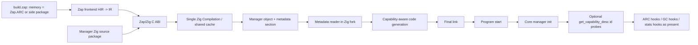
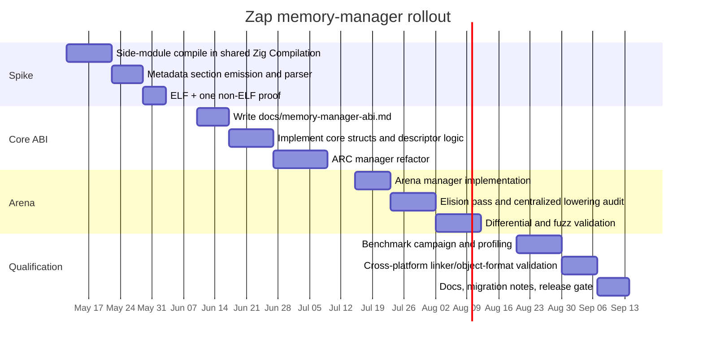

# Comprehensive Design for Pluggable Memory Management in Zap

## Executive summary

The uploaded brief makes the target problem much more concrete than the initial prompt implied: the immediate goal is not a generic “memory system,” but a production-grade, versioned, capability-based ABI for pluggable memory managers in entity["software","Zap","programming language and compiler"], starting with first-party ARC and Arena implementations, preserving current performance and correctness, and remaining forward-compatible with a future `Process.spawn(memory: ...)` per-process model. The current runtime is ARC-first today, with slab-pooled `Arc(T)` cells, inline-header `Map`/`List`/`String` types, a stable Zap↔Zig C ABI, and eleven explicit research questions around build integration, ABI shape, GC/region futures, arena concurrency, elision correctness, and future process isolation. fileciteturn0file0L8-L11 fileciteturn0file0L102-L117 fileciteturn0file0L123-L157 fileciteturn0file0L210-L294 fileciteturn0file0L454-L606

The strongest architecture is to **keep the proposed “mandatory core vtable + optional capability vtables” model**, but tighten it in four places: **compile the manager as a side module inside the same Zig compilation**, **replace “read a const from the symbol table” with a dedicated metadata section**, **make capability discovery obey COM-style static-interface rules**, and **treat future process-level heterogeneity as copy-on-send rather than shared cross-manager references**. Those recommendations are the best fit with the existing Zap/Zig-fork arrangement, with prior art from COM’s static `QueryInterface` rules, Linux `dma-buf` exporter/user separation, C++ `pmr::memory_resource`, Rust’s allocator history, MMTk’s global-plan/per-mutator split, and BEAM-style process heaps. citeturn17view0turn17view1turn17view2turn18view0turn18view2turn17view4turn17view5turn29view0turn20view3turn20view4

The single most important corrective finding is that the draft Arena plan should **not** assume a mutex-wrapped bump allocator if the local fork really tracks entity["software","Zig","programming language and toolchain"] `0.16.0`: Zig’s own `heap.ArenaAllocator` release notes say it became **thread-safe and lock-free**, and the project should reuse or cherry-pick that implementation instead of adding an extra mutex layer unless the fork demonstrably lacks that change. For long-term scalability, the right concurrency story is “one arena per future Zap process,” not “one giant mutex around a whole-program arena.” citeturn14view0turn20view0turn20view1turn14view3turn14view4

For tracing GC and region support, the right move is **reserved, carefully scoped forward-compatibility**, not premature generality. MMTk, Go, Boehm GC, OCaml multicore, Cyclone, MLKit, Rust lifetimes, ATS, and Pony all show that once tracing barriers, mutator attachment, root enumeration, region lifetimes, or ownership transfer enter the system, the interface surface expands quickly. Zap should therefore ship only the minimum stable seams now: capability descriptors with `(id, version, size, flags, vtable_ptr)`, explicit metadata, and core manager lifecycle/allocation hooks; then add tracing and region capability structs later, with manager-level exclusivity for regions in v1. citeturn15view2turn29view0turn29view1turn21view0turn21view3turn22view0turn22view1turn22view2turn20view1turn12view1turn12view2turn11search3turn30view0

The recommended implementation path is a **three-stage rollout**: first, a spike proving same-compilation side-module linking plus metadata extraction; second, ABI hardening and ARC refactor into a manager; third, Arena, elision verification, performance qualification, and documentation. A realistic production estimate is **medium scenario: 3 engineers for 12–16 weeks**, with the spike deliverable available in the first 2–3 weeks if scope is tightly controlled. That timeline assumes no attempt to solve tracing GC or typed region optimization in the initial ship vehicle. The largest technical risks are metadata fragility across ELF/Mach-O/COFF, incomplete retain/release elision coverage, fork drift against Zig upstream, and process-isolation semantics being deferred too long. fileciteturn0file0L430-L450 fileciteturn0file0L615-L639 citeturn14view1turn14view2turn28view0turn23search1turn5search6turn5search19

## Current context and design principles

Zap today is a functional, ahead-of-time language whose runtime is deeply entwined with ARC semantics. The brief says every heap-allocated value is reference-counted, with a generic slab-pooled `Arc(T)` path and separate inline-header paths for variable-sized runtime types like `Map`, `List`, and `String`; both routes ultimately flow through shared retain/release entry points. That means “pluggable memory manager” here is not a small allocator swap: it is a correctness-critical replacement boundary under the language’s core value model. fileciteturn0file0L17-L31 fileciteturn0file0L210-L228

The current memory architecture already exposes the cost of the present design clearly. The slab allocator uses 64 KiB-aligned slabs with side-table `u32` refcounts, pointer masking for slab lookup, atomic counters, eager unmap, and runtime statistics. In the brief’s own `binarytrees` accounting, a 16-byte node plus a 4-byte side-table refcount yields a 20-byte effective footprint and a stated peak architectural floor of roughly 162 MB at 8.4 million live cells. That is important because the memory-manager ABI is not being invented in a vacuum; it is being motivated by a measurable gap against low-overhead allocation strategies. fileciteturn0file0L230-L252

The non-negotiables are also decisive. The proposal already fixes several design choices: whole-program Arena reclamation in v1, compile-time elision of retain/release when `REFCOUNT_V1` is absent, external Zig packages for third-party managers, a mandatory core vtable plus optional capability sub-vtables, and thread safety for all shipped managers. The project also explicitly permits modifying the Zig fork whenever needed. Those constraints strongly favor a solution that is **compiler-integrated, cross-platform, deterministic, and ABI-conscious**, even if it requires deeper fork work up front. fileciteturn0file0L343-L361 fileciteturn0file0L615-L626

The most useful design principles, therefore, are straightforward. The ABI should be **small at the mandatory core**, **explicit at discovery boundaries**, **extensible through immutable capability descriptors**, **build-time inspectable without executing foreign code**, and **semantically compatible with future per-process heaps by forbidding shared mutable object graphs across managers**. That design stance is consistent with COM’s static interface-set rules, Linux `dma-buf`’s exporter/user split, C++ `pmr`’s runtime-polymorphic abstract base, and BEAM’s process-local heap discipline. citeturn17view0turn17view1turn17view2turn18view0turn18view2turn20view2turn20view3turn20view4

The following flow captures the recommended build-time and runtime split.



That flow is feasible because Zig’s official build documentation supports static libraries and C-ABI exports, Zig’s own docs expose exported variables and `linksection`, and the project’s local brief already treats the Zap↔Zig boundary as a stable C ABI that may be extended. citeturn14view1turn14view2turn23search1turn23search7turn0file0

## Survey and gap analysis

The table below prioritizes the most decision-useful literature and implementation sources. Priority reflects immediate value to Zap’s v1 design, not historical importance.

| Priority | Primary source | Type | Key lesson for Zap |
|---|---|---|---|
| P0 | urlCOM QueryInterface docsturn17view0 and urlQueryInterface rulesturn17view1 | Industry ABI | Capability discovery should have **stable identity** and a **static interface set**; if supported once, supported always for that instance. citeturn17view0turn17view1 |
| P0 | urlLinux dma-buf docsturn17view2 | Kernel interface | Exporter/user separation maps cleanly to “manager owns policy, runtime owns use sites”; consumers should not know backing-storage details. citeturn17view2 |
| P0 | urlPolymorphic Memory Resources proposalturn10search1 | Language/library design | Runtime polymorphism with an abstract base plus resource descriptors is a close analogue for Zap’s core vtable. citeturn18view0turn18view1turn18view2 |
| P0 | urlRust GlobalAlloc docsturn17view3, urlRust RFC 1974turn17view4, and urlRust RFC 1398turn17view5 | Language/runtime design | Rust shows why global allocators are easy to stabilize but poor for composition, per-instance state, and future GC integration. citeturn17view3turn17view4turn17view5 |
| P0 | urlMMTk plan overviewturn15view2 and urlMMTk Plan traitturn15view0 | Research/OSS | Future GC support will need a split between **global plan state**, **per-mutator state**, and **barrier selection**. citeturn15view2turn29view0turn29view1turn29view2 |
| P0 | urlErlang GC docsturn20view2 and urlErlang message-passing notesturn20view4 | Industrial runtime | Per-process heaps and copy-on-send are the cleanest answer to future process-level manager selection. citeturn20view2turn20view3turn20view4 |
| P1 | urlCyclone regions paperturn11search0 and urlMLKit region inference paperturn11search1 | Academic | Region systems work best when lifetimes are structural, inferable, and often LIFO-ish; they do not naturally mix with arbitrary shared refcounted graphs. citeturn12view1turn12view2 |
| P1 | urlPerceus paperturn6search0, urlLobster memory management notesturn6search1, and urlLLVM ARC optimization docsturn3search6 | Academic/OSS/compiler | ARC elision success depends on static proofs plus aggressive optimization and strong testing, not on ad hoc local rewrites. citeturn12view0turn24view1turn24view0 |
| P1 | urlZig 0.16 release notesturn14view0 and urlZig build system docsturn14view1 | Toolchain | The right product path is compiler-integrated side-module support, not text-parsing subprocess glue. citeturn14view0turn14view1turn28view0 |
| P2 | urlBiased Reference Counting paperturn24view2 | Academic | If Zap ever revisits ARC hot paths under heavy sharing, thread-biased RC is stronger prior art than coarse locks. citeturn24view2 |
| P3 | urlThread-associated memory allocation patentturn31view0, urlConcurrent GC patentturn31view1, and urlRegion-based memory management patentturn31view2 | Patent landscape | These are worth legal awareness, but they are not the best architectural guidance; papers and official runtime docs are more actionable. citeturn31view0turn31view1turn31view2 |

Across that literature, four gaps stand out.

First, the proposed ABI shape is directionally correct, but the draft’s **capability bitfield extraction mechanism is brittle**. Reading a plain exported `const` via symbol-table inspection is under-specified across ELF, Mach-O, and COFF, especially if the build ever changes visibility, dead-stripping, or section placement. Zig’s docs support exported C-ABI-compatible variables and `linksection`, and ELF/COFF both explicitly model sections and symbol tables, so the more reliable product choice is a **small fixed metadata blob in a dedicated section**, not “parse `nm` output” and not “encode values in a symbol name.” citeturn23search1turn23search7turn28view2turn5search6turn5search19

Second, the current Arena draft appears to lag the underlying toolchain state. The brief proposes a mutex around `std.heap.ArenaAllocator`, but Zig `0.16.0` says `heap.ArenaAllocator` became thread-safe and lock-free and explicitly describes a mutex-wrapped generic `ThreadSafeAllocator` as an anti-pattern. Unless the local fork diverges before that change, Zap should not add back the very contention Zig just removed. fileciteturn0file0L409-L428 citeturn14view0

Third, the draft reserves future GC and region capabilities but does not yet reserve the **shape constraints** that future modular systems need. MMTk’s model makes the distinction visible: a plan is global, a mutator is per-thread, barriers are selected per plan, and allocation semantics map to spaces. That means a future `ZapTracingGCCapabilityV1` cannot be “just a `collect()` callback”; it will almost certainly need mutator attach/detach semantics, root iteration, capability flags for moving vs non-moving collection, and an optional write-barrier surface. citeturn15view2turn29view0turn29view1turn21view0turn21view3

Fourth, the draft wisely postpones `Process.spawn(memory: ...)`, but process isolation should be specified sooner, not later. Erlang’s runtime keeps each process heap separate and copies messages, except for limited special cases such as ref-counted binaries and literals; Pony similarly emphasizes safe sharing only for immutable or isolated data. Those systems strongly suggest that Zap should **ban shared heap references across managers** in its future process model and require copy or transfer semantics at the boundary. citeturn20view2turn20view3turn20view4turn30view0

## Recommended architecture

The core recommendations below answer the brief’s Q1–Q11 directly and also refine the ABI into something safer to ship.

| Question | Recommendation | Why |
|---|---|---|
| Q1 | Add a **new Zig-fork C-ABI entry point** that takes a side-module path (or module source handle) and compiles it in the **same Zig `Compilation` / ZCU** as the Zap-generated object. Use `zig build-lib` only in the spike, not as the long-term product path. | Zig officially supports static-library generation and C-ABI export, but its own tooling/devlog increasingly emphasizes integrated compilation/linking and shared optimization/caching. Zap already treats the fork as modifiable and the C ABI as stable. citeturn14view1turn14view2turn28view0turn0file0turn0file0 |
| Q2 | Replace `extern const zap_memory_capabilities` symbol-value scraping with a **dedicated metadata section**, e.g. `.zapmem` / `__DATA,__zapmem`, containing a fixed struct `{magic, abi_major, abi_minor, size, caps, manager_name_hash, desc_count}`. | Exported vars and `linksection` are officially supported in Zig; object formats make sections and symbol tables explicit, but parsing symbol *values* portably is more fragile than reading a known section payload. citeturn23search1turn23search7turn5search6turn5search19 |
| Q3 | Keep the **core-vtable + capability-descriptor** model, but add **`size` and `version`** to every descriptor and require interface sets to be **static per manager instance**. | This mirrors COM’s strongest rules and captures the same extensibility benefit that `dma-buf` and `pmr` derive from small mandatory surfaces and runtime-described optional functions. citeturn17view0turn17view1turn17view2turn18view0turn18view2 |
| Q4 | Define `TracingGC` as a **future capability descriptor**, not a monolith in the core ABI. Reserve hooks for `mutator_attach`, `mutator_detach`, `visit_roots`, `collection_hint`, `barrier_flags`, and optional `write_barrier`. | Boehm exposes init/allocation/finalization/thread hooks; Go shows barrier semantics matter; MMTk makes mutator/barrier/allocator mapping explicit; OCaml multicore shows per-domain allocation and concurrent/shared heap considerations. citeturn22view0turn22view1turn22view2turn21view0turn21view3turn15view2turn29view0turn20view1 |
| Q5 | Define `RegionV1` around **explicit region handles** and `{create, destroy, alloc}` semantics, but keep regions **manager-exclusive** in v1. Cross-manager coexistence should be by copy/serialization, not shared pointers. | Cyclone and MLKit show the strength of regions when lifetimes are structured; Rust/ATS/Pony show that safe transfer depends on strong ownership/isolation rules. Mixing general refcounted graphs and regions in one manager is much more complex than reserving both capability families. citeturn12view1turn12view2turn11search3turn30view0 |
| Q6 | For `Zap.Arena`, prefer **Zig’s current lock-free ArenaAllocator** if present in the fork; otherwise cherry-pick it. Defer per-thread sub-arenas unless profiling proves need. Do not ship a coarse mutex as the default. | Zig `0.16.0` explicitly says ArenaAllocator became thread-safe and lock-free; OCaml, mimalloc, and TCMalloc all reinforce the value of local allocation paths before global contention control. citeturn14view0turn20view0turn20view1turn14view3turn14view4 |
| Q7 | Validate compile-time ARC elision with **three layers**: a centralized lowering audit, differential test runs under ARC vs Arena, and property-/fuzz-driven ownership classification tests. | LLVM’s ARC passes expose optimization counters; Lobster reports large RC-operation reductions via ownership analysis; Perceus combines formal reasoning with performance evidence. Zap should emulate that discipline, not rely on hand inspection. citeturn24view0turn24view1turn12view0 |
| Q8 | Keep the inline `ArcHeader` on `Map`/`List`/`String` for v1. If later needed, introduce a **per-binary layout policy** in the compiler/runtime, not ad hoc alternate type definitions. | The brief’s own constraints favor low-risk v1 shipping; Swift’s runtime allocation and uniqueness machinery is deeply tied to object headers, and BRC’s Swift results show header-level changes are runtime-wide, not local. fileciteturn0file0L556-L569 citeturn19view0turn19view1turn24view2 |
| Q9 | Specify future spawn-time diversity as **BEAM-style copy-on-send**. No shared heap references across managers; large immutable blobs may get special treatment later, but not general objects. | Erlang copies messages specifically to keep GC local to each process; Pony allows safe sharing only for immutable or isolated data. This is the cleanest semantic fit for manager heterogeneity. citeturn20view3turn20view4turn30view0 |
| Q10 | Put first-party managers in **`src/memory/arc.zig`** and **`src/memory/arena.zig`**. | The brief’s project layout already establishes `src/` as Zig compiler/runtime code and `lib/` as Zap stdlib source. That makes `src/memory/` the most idiomatic low-churn placement. fileciteturn0file0L65-L83 fileciteturn0file0L584-L598 |
| Q11 | Run a **two-risk spike** first: same-compilation side-module linking plus metadata-section extraction. Make success criteria cross-platform at least for ELF and one non-ELF target before expanding. | Those two uncertainties dominate the design. The brief itself identifies them as the highest implementation risks; resolving them early is the fastest path to certainty. fileciteturn0file0L600-L606 |

A revised ABI sketch that fits those decisions is below.

```c
typedef struct {
    uint32_t id;          // 'REFC', 'GCOL', 'REGN', ...
    uint16_t version;     // capability struct version
    uint16_t size;        // sizeof(vtable or descriptor-owned struct)
    uint32_t flags;       // e.g. moving collector, needs barrier, thread-local
    const void *vtable;   // typed by capability id/version
} ZapCapabilityDescV1;

typedef struct {
    uint16_t abi_major;
    uint16_t abi_minor;
    uint32_t size;
    uint64_t declared_caps;   // compile-time summary
    void *(*init)(const ZapInitOptions *);
    void  (*deinit)(void *ctx);
    void *(*allocate)(void *ctx, size_t size, uint32_t align);
    void  (*deallocate)(void *ctx, void *ptr, size_t size, uint32_t align);
    const ZapCapabilityDescV1 *(*get_capability_desc)(void *ctx, uint32_t id);
} ZapMemoryManagerCoreV1;

typedef struct {
    uint32_t magic;       // 'ZMEM'
    uint16_t abi_major;
    uint16_t abi_minor;
    uint16_t size;
    uint16_t object_fmt;  // ELF/Mach-O/COFF
    uint64_t declared_caps;
    uint32_t desc_count;
    uint32_t reserved;
} ZapMemoryManagerMetaV1;
```

This revision is intentionally conservative. It preserves the draft’s core idea while separating **build-time inspectable metadata** from **runtime callable interfaces**, which is exactly the separation suggested by COM’s static interface model and `dma-buf`’s exporter/user discipline. It also borrows the “abstract interface + versionable details behind descriptors” spirit of C++ `pmr` without inheriting Rust’s global-singleton limit. fileciteturn0file0L356-L400 citeturn17view0turn17view1turn17view2turn18view0turn17view4

The metadata should live in a dedicated object-file section emitted by the manager package at compile time. In Zig terms, the manager can export a C-ABI-compatible metadata object and place it in a named section with `linksection`; Zap or the Zig fork should then parse that section directly using an object-format-aware reader, not a subprocess `nm`, not shell parsing, and not symbol-name encoding tricks. Zig’s language reference explicitly supports exported variables and section placement, while ELF and COFF explicitly define section and symbol-table mechanisms. citeturn23search1turn23search7turn5search6turn5search19

## Evaluation, rollout, and operations

The evaluation plan should combine language-benchmark continuity, runtime-specific microbenchmarks, and build-/ABI-level conformance checks. The brief already requires preserving all current tests under `Zap.ARC`, preserving benchmark correctness, and proving the two main integration risks before committing. That should become a formal gate structure, not an informal checklist. fileciteturn0file0L107-L117 fileciteturn0file0L615-L639

| Workload / suite | Why it matters | Metrics to track | Primary source |
|---|---|---|---|
| `binarytrees` | Allocation density and reclamation overhead; best stressor for ARC-vs-Arena differences. citeturn26search4 | wall time, peak RSS, allocations/s, bytes/object, slab/arena stats | urlbinary-trees descriptionturn26search4 |
| `nbody` and `spectral-norm` | Compute-heavy baselines that should show near-zero regression if capability-elision works. citeturn26search5turn26search3 | wall time, code size, branch misses, cache misses | urln-body descriptionturn26search5 and urlspectral-norm descriptionturn26search3 |
| `k-nucleotide` | Hashing/container-heavy workload useful for `Map`/`String` behavior. citeturn26search2 | throughput, peak RSS, allocation lifetime histogram | urlk-nucleotide descriptionturn26search2 |
| Full Zap test suite | Semantic equivalence and codegen elision correctness. fileciteturn0file0L107-L117 | pass rate, snapshot diffs, coverage of retain/release sites | Uploaded brief |
| Arena contention microbench | Explicit answer to Q6; should include 1, 2, 4, 8, 16 allocator threads. | allocations/s, p99 alloc latency, cache-line bouncing, lock time | Derived design benchmark |
| Build/ABI conformance | Ensures metadata extraction and side-module linking are deterministic across object formats. | success/failure, parse correctness, cross-target compatibility | Derived design benchmark |

The runtime tooling stack should stay close to official, low-level observability tools:

| Tool | Best use | Evidence |
|---|---|---|
| urlperf statturn27search0 / urlperf recordturn27search10 | Hardware counters, instruction count, branch/cache behavior on Linux | `perf` is the kernel-backed performance-counter framework and supports both aggregate stats and recorded profiles. citeturn27search0turn27search4turn27search10turn27search18 |
| urlValgrind Massifturn27search1 | Heap growth curves and peak-memory attribution | Massif is explicitly a heap profiler for useful bytes plus allocation overhead. citeturn27search1 |
| urlValgrind DHATturn27search15 | Block-lifetime and utilization analysis | DHAT is aimed at block lifetimes and layout inefficiencies, which is useful for inline-header container analysis. citeturn27search15 |
| urlValgrind manualturn27search5 | General memory-management bug detection in the differential harness | The current manual documents contemporary tool support and release state. citeturn27search5 |
| urlheaptrack repoturn27search6 | Linux heap-callsite attribution over time | The project is specifically a heap memory profiler for Linux. citeturn27search6 |
| Zap runtime counters | Slab/arena-specific internal stats the generic tools cannot infer | The brief already describes `ZAP_ARC_STATS=1` and related pool counters. fileciteturn0file0L244-L247 |

The recommended rollout plan is staged to minimize irreversible decisions:



Deployment should be intentionally boring. The manifest keeps `memory:` defaulting to `Zap.ARC`; the manager ABI document becomes normative; the compiler errors out early if metadata is missing, the ABI major mismatches, a declared capability is malformed, or a required optional descriptor is absent. Cross-platform CI should at minimum validate Linux ELF, macOS Mach-O, and Windows COFF metadata parsing, because object-format differences are exactly where “works on my machine” metadata schemes usually fail. Zig’s own support tables and build docs show these targets are expected linker outputs, so this can be tested as a normal artifact path. fileciteturn0file0L102-L103 citeturn14view1turn28view1turn5search6turn5search19

A practical resource estimate, with assumptions stated openly, is below.

| Scenario | Team | Duration | Engineering effort | What it buys |
|---|---|---:|---:|---|
| Low | 2 engineers | 8–10 weeks | 20–25 eng-weeks | Spike, core ABI, ARC refactor, Arena, Linux-first qualification |
| Medium | 3 engineers | 12–16 weeks | 40–55 eng-weeks | Cross-platform metadata parsing, stronger test harness, documentation, performance qualification |
| High | 4–5 engineers | 20–28 weeks | 80–110 eng-weeks | Everything above plus forward-looking GC/region descriptor scaffolding, process-isolation prototype, deeper fork cleanup |

If a fully loaded engineering month is assumed to be roughly **$20k–$30k per engineer-month**, those scenarios translate very roughly to **$100k–$180k**, **$220k–$420k**, and **$450k–$900k** respectively. Those numbers are not market facts; they are planning estimates intended to let the project compare staffing shapes under the current unknowns around target platforms, team mix, and geography.

The risk profile is manageable if addressed explicitly:

| Risk | Likelihood | Impact | Mitigation |
|---|---|---|---|
| Metadata parsing breaks across object formats | Medium | High | Use a dedicated metadata section, not `nm` text parsing; test ELF, Mach-O, COFF early |
| Arena contention regresses parallel workloads | Medium | Medium | Reuse Zig’s lock-free ArenaAllocator; benchmark before adding per-thread sharding |
| Missed retain/release callsites under Arena elision | Medium | High | Centralize lowering, differential test ARC vs Arena, fuzz ownership classifier |
| ABI ossifies too early | Low | High | Add `version` and `size` to core and descriptors; keep mandatory surface minimal |
| Fork drift from Zig upstream | Medium | Medium | Keep changes localized to side-module compilation, metadata parsing, and C ABI |
| Future process heterogeneity becomes semantically messy | Medium | High | Lock in copy-on-send semantics before `Process.spawn(memory: ...)` lands |
| Inline `ArcHeader` overhead under Arena is worse than expected | Low | Medium | Measure first; treat conditional layout as v2 compiler/runtime work, not v1 |

## Open questions and limitations

Some areas remain genuinely open, even after the strongest available survey.

The first is **implementation detail inside the local Zig fork**. The public Zig documentation and release notes are enough to recommend “same-compilation side module” and “no extra mutex if ArenaAllocator is already lock-free,” but the final choice still depends on whether the local fork already includes those upstream changes or whether Zap must cherry-pick them. That is a repository-state question, not a literature question. citeturn14view0turn14view1

The second is **how much future GC surface to reserve now**. The report recommends descriptor-based forward compatibility and a small tracing-GC seam because that is the safest v1 move; however, a real tracing collector choice later will still force decisions about moving vs non-moving objects, safepoints, root representation, and barrier placement. MMTk, Go, OCaml, and Boehm make the need clear, but they do not dictate a single minimal surface for Zap without knowing more about Zap’s future concurrency/runtime shape. citeturn15view2turn29view0turn21view0turn20view1turn22view2

The third is **Swift-specific allocator-hook precedent**. Swift’s runtime source and ARC infrastructure are highly relevant, and the forum discussions confirm ecosystem demand for allocator pluggability, but Swift does not currently provide a clean public “global allocator hook” equivalent to Rust’s `#[global_allocator]`. That makes Swift excellent prior art for ARC optimization and header-level RC costs, but weaker prior art for Zap’s external-manager ABI shape. citeturn19view0turn19view1turn19view2turn19view3

The final limitation is that **the patent landscape should be treated as awareness, not architecture**. The patent sources surfaced thread-associated allocation, concurrent-collection, and region-based-memory claims, but they are too broad and too implementation-agnostic to improve Zap’s immediate design choices. They matter for diligence, not for selecting the best v1 ABI. citeturn31view0turn31view1turn31view2
